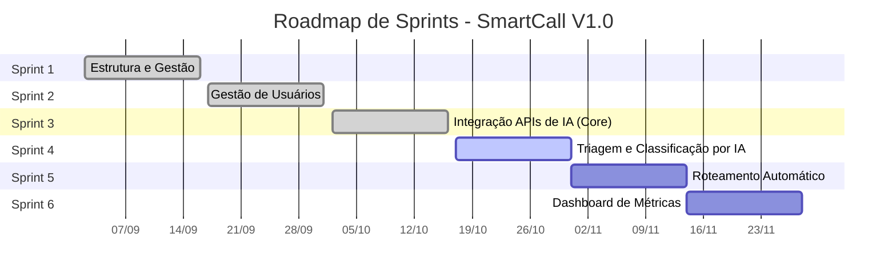

## Cronograma de Evolução

## Cronograma Visual de Evolução

O roadmap abaixo apresenta uma visão geral do planejamento de Sprints para a entrega da Versão 1.0 do SmartCall.

```mermaid
gantt
    title Roadmap de Sprints - SmartCall V1.0
    dateFormat  YYYY-MM-DD
    axisFormat %d/%m

    section Sprint 1
    Estrutura e Gestão:done,    s1, 2025-09-02, 14d

    section Sprint 2
    Gestão de Usuários :done,    s2, 2025-09-17, 14d

    section Sprint 3
    Integração APIs de IA (Core) :done,    s3, 2025-10-02, 14d

    section Sprint 4
    Triagem e Classificação por IA :active,  s4, 2025-10-17, 14d
    
    section Sprint 5
    Roteamento Automático :      s5, 2025-10-31, 14d

    section Sprint 6
    Dashboard de Métricas :      s6, 2025-11-14, 14d

```
